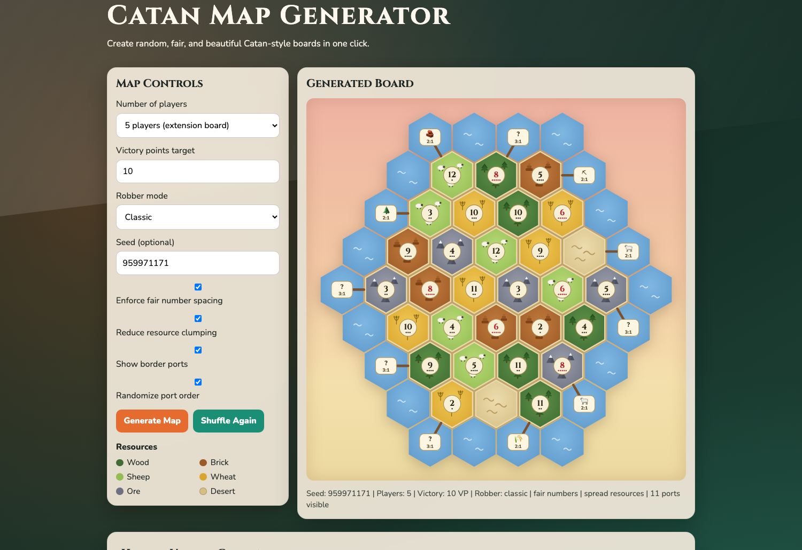

# Catan Map Generator

A free, in-browser generator for random, balanced Catan-style boards. Everything runs client-side — no build step, no backend, no dependencies. Just three static files.

**Live site:** https://catan-boardgame-map-generator.web.app

## What It Does

Pick a player count, click **Generate Map**, and get a board your group can rebuild with their physical tiles:

- **Classic and extension boards** — 19 hexes for 2–4 players, the 30-hex 5–6 player extension layout (3-4-5-6-5-4-3) with 28 number tokens and 11 harbors
- **Fairness checks** — optionally reject boards where a 6 or 8 touches another 6 or 8, and boards where too many same-resource hexes clump together
- **Seeded generation** — the same seed always produces the same board, so groups can share setups. Shareable URLs work too: `/?seed=gamenight&players=6`
- **Authentic port layout** — 3:1 and 2:1 harbors placed on a ring of sea hexes around the island (correct port mix for both board sizes)
- **Illustrated SVG board** — original hand-drawn terrain art, cream number tokens with probability pips (red 6/8), scales to any screen size

## How It Works

The board is modeled on an axial hex-coordinate grid. Each generation attempt shuffles the resource deck and number tokens, then validates the result against the enabled fairness rules (using proper hex adjacency); failing layouts are retried with a derived seed, so results stay deterministic per seed. The final board — land tiles, sea ring, ports, and tokens — is rendered as a single inline SVG.

## Project Structure

- `index.html` — page markup and controls
- `styles.css` — visual design and responsive layout
- `script.js` — board generation, fairness validation, and SVG rendering
- `firebase.json` / `.firebaserc` — Firebase Hosting configuration (two sites: the app and a legacy-URL redirect)
- `legacy-redirect/` — fallback page for the old hosting URL
- `docs/` — repository assets (screenshots), not deployed

## Disclaimer

This is an independent fan-made utility for game nights. It is not affiliated with, endorsed by, or connected to any publisher of the Catan board game. All artwork is original.
